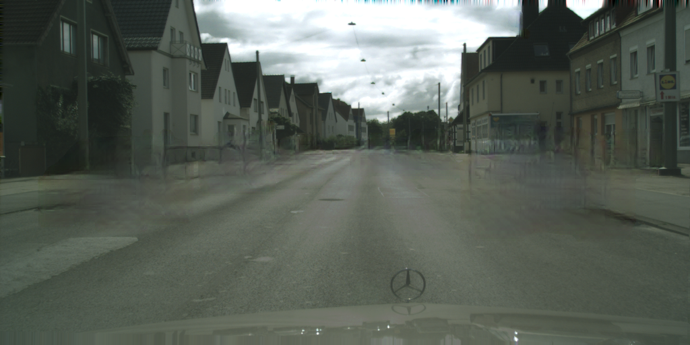

# GanonymizerV3 App

## Examples
input / output (ganonymized)





## Usage

### GANonymize Image

`POST /image`

Request

- Authorization
  - Basic Auth

- Headers
  - Content-Type: application/json

- Body (json)
```
{
  "image": "${base64 encoded image}"
}
```

Response (json)
```
{
  "image": "${base64 encoded image}"
}
```

## Development

### Setup
```
$ copy .env.default .env

# set variables in .env
```

### Start service (stg)
```
$ bash ./scripts/run.sh
```

### Start service (prod)

Create ssl with Let's Encrypt.

```
$ bash ./scripts/run.sh prod
```

